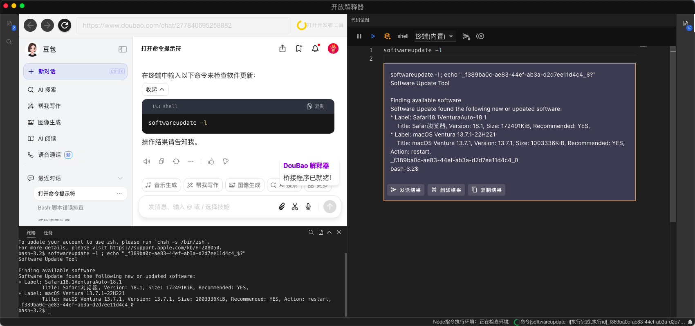
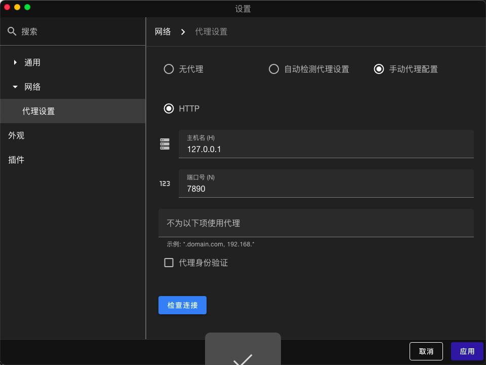

# 开放解释器

开放解释器，提供网页版 gpt 的解释功能。
！！！不要随意启用自动执行代码和自动上传指令执行结果功能，请仔细观察 AI 给你提供的代码或指令，并注意保护你的隐私
！！！Gpt 也会犯错，请仔细辨别数据

## 工作流程

- 通过解析 ses 流量获取明文，在通过 agent 解析出真实的相应数据。
- 解析响应中的指令，发送给对应的指令插件执行，将执行结果发送给 ai，直到结束

## 特点

- 自动执行代码

- 自动发送执行结果

- 扩展插件支持

- 支持 gpt(及其镜像站）和 doubao 解析




### 必要环境

    node <=20
    python <= 3.11
    window visual studio，安装c++桌面环境，在单个组件中选择带有msvc-***-spectre缓解库

## 如何编译

### 1、编译 node—pty

```bash
    cd libs/node-pty
    npm install
```

### 2、编译 lib

```bash
    cd lib
    npm run build
```

### 3、编译插件

```bash
    npm run plugin i;
    npm run plugin run build;
```

### 4、编译主程序

```bash
npm config edit
# 该命令会打开npm的配置文件，请在空白处添加
# registry=https://registry.npmmirror.com
# ELECTRON_MIRROR=https://npmmirror.com/mirrors/electron/
# ELECTRON_BUILDER_BINARIES_MIRROR=https://npmmirror.com/mirrors/electron-builder-binaries/
# 然后关闭该窗口，重启命令行.
# 使用yarn安装
npm install
# 启动之后，会在9080端口监听
npm run dev
# build命令在不同系统环境中，需要的不一样，需要自己根据自身环境进行配置
npm run build
```

---

## 项目结构

    lib 此目录为提供给插件的依赖，包括暴漏的api、类型等。
        main 暴漏的主程序api
        dev 开发依赖（用于热更新)
        preload 预加载api
        render 渲染api
    src 主应用所在目录
        main 主进程源代码
            ipc-bind ipc绑定包
                core-ipc-bind 核心ipc通信钩子
                core-ipc-window-bind 窗口ipc通信钩子
                menus-ipc-bind 菜单ipc通信钩子
                setting-ipc-bind 设置ipc通信钩子
                proxy-ipc-bind 代理ipc设置钩子
            plugin 插件管理包
                plugin-manager 插件管理器
                resource-manager 资源管理器（提供给插件使用）
            services
                global-agents 全局代理管理，提供应用全局proxy功能
                proxy mitm拦截器，提供请求拦截功能，并分发到agent插件处理,(获取https报文明文)
                service-inner-shell 内置pty
                service-menu 菜单管理服务
                service-setting 设置服务
                web-content-listener 渠道管理服务
                window-manager 窗口管理服务
                window-settings 设置窗口服务
            index.ts 主进程
        render 渲染进程代码
        preload 预加载程序
            index.ts 主窗口预加载脚本
            webview.ts 内置webview预加载脚本
            setting-ipc 设置界面预加载脚本
    libs
        node-pty node-pty分支的修改，兼容本项目
    plugins 插件目录
        proxy 支持gpt以及相关镜像网站的解释器
        proxy_doubao 支持doubao的解释器
        node_executor node执行器
        python_executor python执行器
        ssh_executor ssh执行器，使用内置pty

---

## 解释

    插件，用于提供代理或则执行功能的扩展，分为agent类型和executor两种
        -agent的main程序由src/main/service/proxy.ts调用，提供sse流解析出全报文的功能，render程序由src/preload/webview.ts调用，用于插件在webview中操作的能力。
        -executor由src/main/services/executor.ts调用，用于执行解析出的指令

## 本项目使用的三方库

    node-pty 用于内置终端后端
    xtermjs 用于终端界面
    vueMonaco 用于编辑器
    electron 用于应用主体
    vuetify 用于ui界面
    vue3    用于ui框架
    vue-code-layout 用于主界面布局
    electron-vite-template 项目模板
